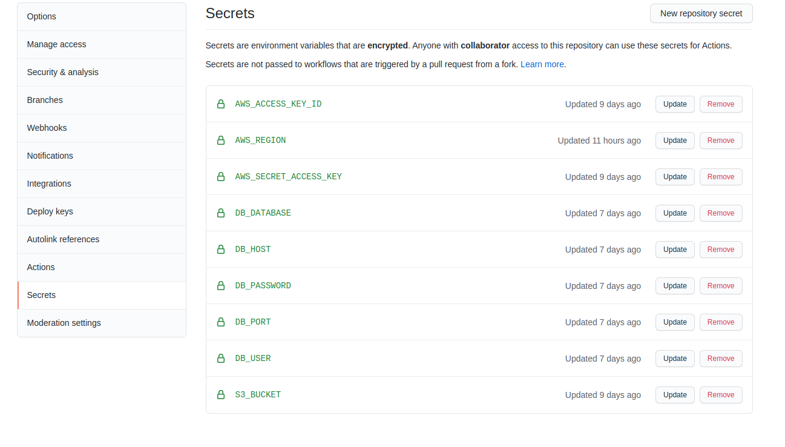

Logger Introduction
===========
The goal of this logger is to capature all the events generated by SES as a notification or configset events, store them to a MySQL database, and then foward the notification to a URL stored in the database.

This code is still experimental and require some modifications to be an independent package

## Getting Started
In order to get started you need to do the following: 

1. Fork the repo
2. Go to the Settings -> Secrets in the forked repo
3. Add the required fields as shown in the screenshot below
4. Create a MySQL database then the file inside `database/migration.sql`
5. Clone your fork and push to `deploy` branch to run the deployment script
6. Add VPC to your lambda function to access Mysql

## Disclaimer
This code require some knowdlge in NodeJS and lambda functions it is not ended non-developers yet.

## Do you want to contribute?
Just make a fork and submit a PR

### Contact Info
* Mohammad Abu Musa <a mailto:="m.abumusa@gmail.com">m.abumusa[at]gmail.com</a>